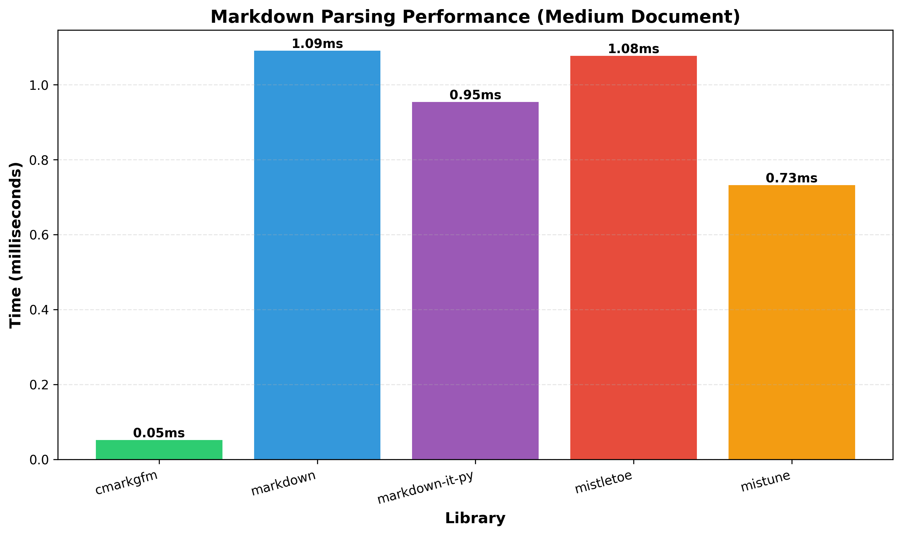
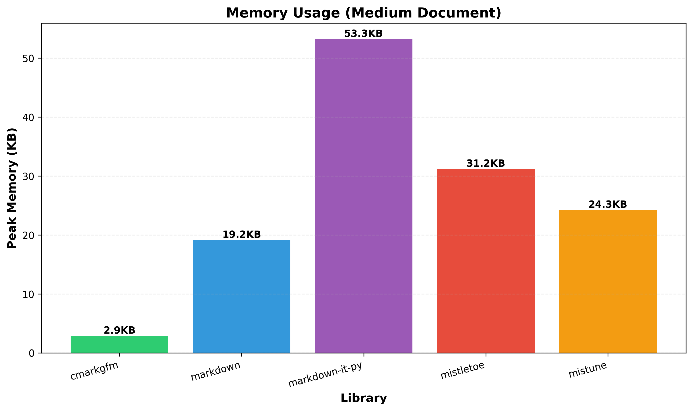

# Python Markdown Libraries: Performance Benchmark & Feature Comparison

A comprehensive analysis comparing **cmarkgfm** with other popular Python markdown libraries including Python-Markdown, mistune, mistletoe, and markdown-it-py.

## Executive Summary

**Key Findings:**
- 🏆 **cmarkgfm is the clear performance winner**, being 15-25x faster than pure Python implementations
- 💾 **cmarkgfm uses significantly less memory** than alternatives
- ⚡ **Performance gap widens with document size** - cmarkgfm scales much better
- 🔧 **Pure Python libraries offer more flexibility** through plugins and extensions
- ✅ **All tested libraries support CommonMark** to varying degrees

## Performance Benchmarks

### Parsing Speed Comparison



The chart above shows the average parsing time for a medium-sized markdown document (approximately 1KB). **cmarkgfm is dramatically faster** than all pure Python alternatives:

- **cmarkgfm**: 0.052ms
- **mistune**: 0.732ms (14x slower)
- **markdown-it-py**: 0.954ms (18x slower)  
- **mistletoe**: 1.077ms (21x slower)
- **Python-Markdown**: 1.091ms (21x slower)

### Memory Usage Comparison



cmarkgfm also leads in memory efficiency, using just **2.91KB** of peak memory compared to:

- **Python-Markdown**: 19.18KB (6.6x more)
- **mistune**: 24.27KB (8.3x more)
- **mistletoe**: 31.24KB (10.7x more)
- **markdown-it-py**: 53.27KB (18.3x more)

### Performance Across Document Sizes


This chart demonstrates how each library scales with document size. **cmarkgfm maintains its performance advantage** across all document sizes:

| Library | Simple (0.2KB) | Medium (1KB) | Large (50KB) |
|---------|---------------|--------------|--------------|
| **cmarkgfm** | 0.018ms | 0.052ms | 1.998ms |
| **mistune** | 0.169ms | 0.732ms | 36.927ms |
| **markdown-it-py** | 0.232ms | 0.954ms | 50.262ms |
| **mistletoe** | 0.260ms | 1.077ms | 52.733ms |
| **Python-Markdown** | 0.285ms | 1.091ms | 50.779ms |

The performance gap grows substantially with larger documents - on a 50KB document, cmarkgfm is **25x faster** than the slowest pure Python alternative.

## Feature Comparison

### Overview Matrix

| Feature | cmarkgfm | Python-Markdown | mistune | mistletoe | markdown-it-py |
|---------|----------|-----------------|---------|-----------|----------------|
| **Implementation** | C + Python | Pure Python | Pure Python | Pure Python | Pure Python |
| **CommonMark Compliant** | ✅ Yes | ❌ No* | ✅ Yes | ✅ Yes | ✅ Yes |
| **GFM Support** | ✅ Built-in | ⚠️ Extension | ✅ Built-in | ✅ Built-in | ⚠️ Plugin |
| **Tables** | ✅ | ✅ | ✅ | ✅ | ✅ |
| **Strikethrough** | ✅ | ❌ | ✅ | ✅ | ✅ |
| **Task Lists** | ✅ | ⚠️ Extension | ✅ | ✅ | ⚠️ Plugin |
| **Custom Extensions** | ❌ | ✅ | ✅ | ✅ | ✅ |
| **Plugin System** | ❌ | ✅ | ✅ | ❌ | ✅ |
| **Multiple Renderers** | ❌ | ❌ | ✅ | ✅ | ✅ |
| **AST Access** | ❌ | ✅ | ✅ | ✅ | ✅ |

\* Python-Markdown follows the original Markdown spec, not CommonMark

### Detailed Library Analysis

#### cmarkgfm

**Description:** Python bindings to GitHub's fork of cmark (CommonMark implementation in C)

**Strengths:**
- ⚡ **Extremely fast** - C implementation provides superior performance
- 🎯 **GitHub Flavored Markdown** support out of the box
- ✅ **CommonMark compliant** - follows the spec precisely
- 🏭 **Battle-tested** - used in production by GitHub
- 💪 **Excellent for high-volume applications**

**Limitations:**
- 🔒 **Limited extensibility** - no plugin system
- 🛠️ **Requires C compiler** for building from source (though wheels are available)
- 📦 **Not pure Python** - may complicate deployment in some environments

**Best For:**
- High-performance web applications
- GitHub-compatible markdown rendering
- Production systems processing large volumes
- Applications where speed is critical

#### Python-Markdown

**Description:** The original and most mature pure Python markdown implementation

**Strengths:**
- 🔌 **Highly extensible** - rich extension API
- 📚 **Mature ecosystem** - many built-in and third-party extensions
- 🐍 **Pure Python** - easy installation, no compilation needed
- 📖 **Excellent documentation**
- 🔧 **Custom markdown syntax** possible through extensions

**Limitations:**
- 🐢 **Slower** than C-based or optimized pure Python implementations
- ❌ **Not CommonMark compliant** by default (follows original Markdown spec)
- 💾 **Higher memory usage**
- 🤔 **Complex extension system** can have a learning curve

**Best For:**
- Projects requiring custom markdown dialects
- Python-only deployment environments
- When flexibility trumps performance
- Legacy projects already using Python-Markdown

#### mistune

**Description:** Fast and full-featured pure Python markdown parser with v3 CommonMark compliance

**Strengths:**
- 🚀 **Fastest pure Python implementation**
- ✅ **CommonMark compliant** (v3+)
- 🔧 **GFM support built-in**
- 🎨 **Multiple output formats** (HTML, AST, etc.)
- 🔌 **Modern plugin system**
- 🐍 **Pure Python** - easy deployment

**Limitations:**
- 🔄 **API changed significantly** in v3 (migration may be needed)
- 👥 **Smaller community** than Python-Markdown
- 📦 **Fewer third-party extensions**

**Best For:**
- Modern applications needing both speed and extensibility
- Projects requiring pure Python with good performance
- CommonMark-compliant parsing with GFM features
- When you need AST access in pure Python

#### mistletoe

**Description:** Fast, extensible, spec-compliant markdown parser with multiple output formats

**Strengths:**
- ⚡ **Fast pure Python parser**
- ✅ **CommonMark compliant**
- 📝 **Multiple output formats** - HTML, LaTeX, AST, and more
- 🎯 **Easy to create custom tokens**
- 🏗️ **Clean AST-based architecture**
- 🐍 **Pure Python**

**Limitations:**
- 👥 **Smaller community**
- 📖 **Less documentation** than major alternatives
- 🔌 **Fewer third-party extensions**

**Best For:**
- Projects needing multiple output formats (especially LaTeX)
- Custom token definitions
- Academic and research applications
- When you need a clean AST for processing

#### markdown-it-py

**Description:** Python port of the popular markdown-it JavaScript parser

**Strengths:**
- ✅ **CommonMark compliant**
- 🏗️ **Modern plugin architecture**
- 📈 **Active development**
- 🔒 **Excellent security features**
- 🌐 **Compatible with markdown-it ecosystem**
- 🐍 **Pure Python**

**Limitations:**
- 🆕 **Newer library** (less mature than Python-Markdown)
- 👥 **Smaller Python ecosystem**
- 🔌 **Requires plugins** for GFM features

**Best For:**
- Modern CommonMark parsing requirements
- Projects requiring strong security
- Applications using markdown-it in other languages
- When you want markdown-it's architecture in Python

## Methodology

### Benchmark Setup

**Test Documents:**
- **Simple**: ~200 bytes - basic formatting
- **Medium**: ~1KB - mixed features including tables, code blocks, lists
- **Large**: ~50KB - repeated medium document for scale testing
- **GFM**: Focused on GitHub Flavored Markdown features

**Metrics:**
- **Parsing Time**: Average of 100 iterations per document (5 warmup runs)
- **Memory Usage**: Peak memory allocation during parsing
- **Python**: 3.12.3

**Hardware:**
- GitHub Actions runner environment
- Consistent for all tests

### Feature Analysis

Features were analyzed by:
1. Reviewing official documentation for each library
2. Examining source code on GitHub
3. Testing actual functionality
4. Consulting library README files and specifications

## Recommendations

### Choose **cmarkgfm** if:
- ⚡ Performance is critical
- 📊 Processing high volumes of markdown
- 🎯 Need GitHub Flavored Markdown compatibility
- 🏭 Building production web services
- ✅ CommonMark compliance is required

### Choose **Python-Markdown** if:
- 🔧 Need extensive customization
- 📚 Using existing extensions
- 🐍 Pure Python is mandatory
- 🔌 Building custom markdown syntax
- 📖 Require mature, well-documented solution

### Choose **mistune** if:
- ⚖️ Want balance of speed and features
- 🐍 Need pure Python with good performance
- ✅ CommonMark compliance matters
- 🎨 Need multiple output formats
- 🔌 Want modern plugin system

### Choose **mistletoe** if:
- 📝 Need LaTeX or other non-HTML output
- 🎯 Creating custom token types
- 🏗️ Want clean AST-based architecture
- 🔬 Academic or research use

### Choose **markdown-it-py** if:
- 🔒 Security is a top priority
- 🌐 Using markdown-it in other languages
- 🆕 Want modern, actively developed solution
- ✅ Need CommonMark with good extensibility

## Running the Benchmarks

To reproduce these benchmarks:

```bash
cd python-markdown-comparison

# Install dependencies
pip install -r requirements.txt

# Run feature analysis
python3 feature_analysis.py

# Run benchmarks
python3 benchmark.py

# Generate charts
python3 generate_charts.py
```

## Conclusion

**cmarkgfm is the clear winner for performance-critical applications**, offering dramatically faster parsing and lower memory usage thanks to its C implementation. It's the obvious choice for high-throughput production systems, especially when GitHub Flavored Markdown compatibility is needed.

However, **pure Python alternatives have their place**:
- **Python-Markdown** for maximum flexibility and extensions
- **mistune** for the best pure Python performance
- **mistletoe** for multiple output formats
- **markdown-it-py** for modern architecture and security

The choice ultimately depends on your specific requirements: if performance is paramount, choose cmarkgfm. If you need extensive customization or pure Python deployment, consider the alternatives.

## Files in This Report

- `README.md` - This comprehensive report
- `benchmark.py` - Performance benchmarking script
- `generate_charts.py` - Chart generation script
- `feature_analysis.py` - Feature comparison analysis
- `test_documents.py` - Test markdown documents
- `requirements.txt` - Python dependencies
- `benchmark_results.json` - Raw benchmark data
- `feature_comparison.json` - Detailed feature data
- `performance_chart.png` - Parsing speed comparison
- `memory_chart.png` - Memory usage comparison
- `document_size_chart.png` - Scaling performance chart

## References

- [cmarkgfm on GitHub](https://github.com/theacodes/cmarkgfm)
- [Python-Markdown on GitHub](https://github.com/Python-Markdown/markdown)
- [mistune on GitHub](https://github.com/lepture/mistune)
- [mistletoe on GitHub](https://github.com/miyuchina/mistletoe)
- [markdown-it-py on GitHub](https://github.com/executablebooks/markdown-it-py)
- [CommonMark Specification](https://spec.commonmark.org/)
- [GitHub Flavored Markdown Spec](https://github.github.com/gfm/)
